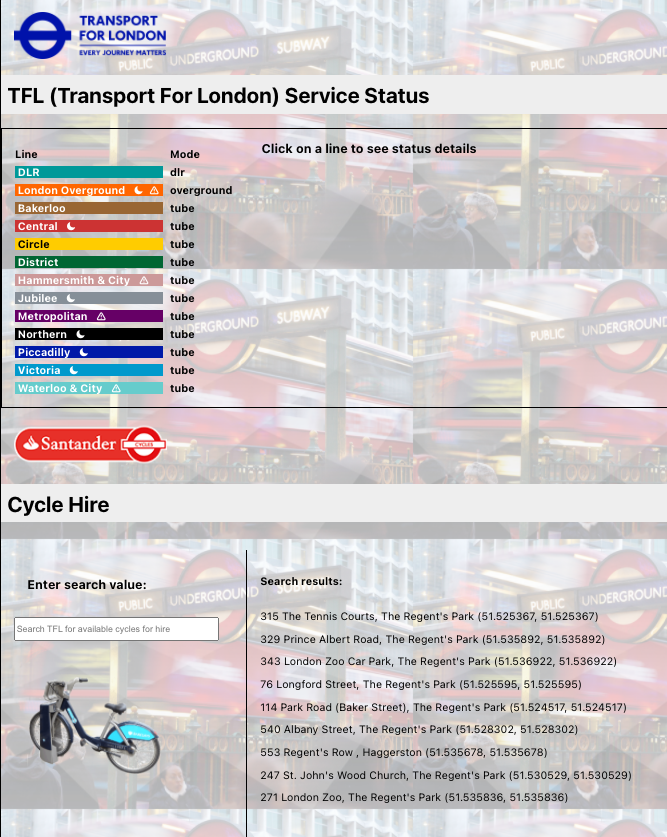
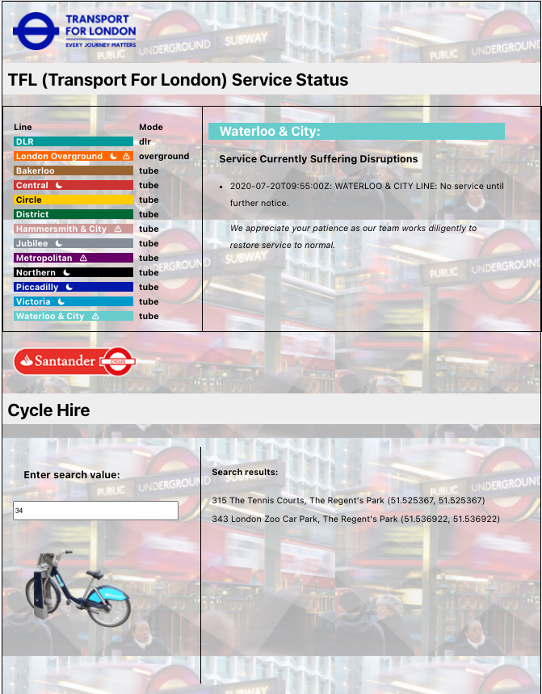
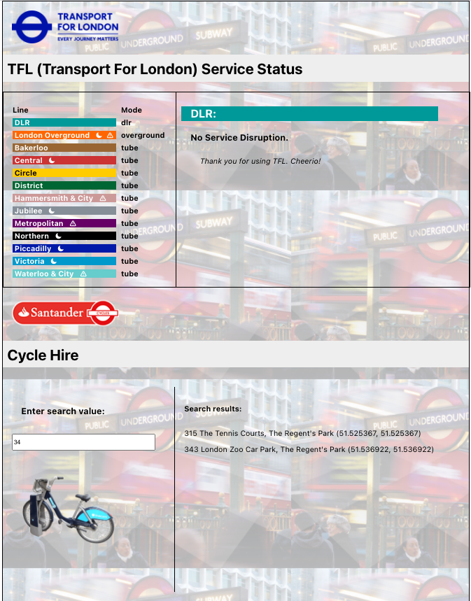
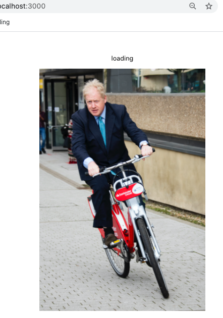

# TFL LITE
**by Karen Liu**

*This React app, generated using [`create-react-app`](https://github.com/facebookincubator/create-react-app) in the command line, pulls data from the official [TFL (Transport for London) API](https://api.tfl.gov.uk/) and displays a menu of available lines. Users can view current status information and service interruptions and search for available cycles for hire in the London area. TFL LITE uses ES6 and Typescript (`App.js` is regular JS). It greets the user with the whimsy of Prime Minister Johnson riding one of his Boris bikes on the loading screen. The colors used for the line names are the [official hex colors](http://content.tfl.gov.uk/tfl-colour-standards-issue04.pdf) used by TFL.*

*Note: The screenshots and screencapture were taken before the line-name colors were updated to the latest official TFL color guide. The [original color guide](https://rodcorp.typepad.com/rodcorp/2005/07/what_colours_ar.html) used was from 2005. The app is currently updated to reflect the new line colors.* 

## Dependencies and Tech:
[`React-table (version 7.6.3)`](https://www.npmjs.com/package/react-table)

`React-table Types (version 7.0.29)`

*I chose to use the React-table library because it's highly-customizable with a lot of users and reviews, which means it's relatively easy to find solutions to issues I might run into. The documentation is weak; however, for this exercise I didn't need a lot of table features. For future projects I may try a different library with better documentation and better support for Typescript. After leveraging react-table, I discovered that the typescript types defined in react-table @types are [not compatible with the most recent version of react-table](https://github.com/tannerlinsley/react-table/discussions/2664). I worked around it by [using `any`](https://github.com/tannerlinsley/react-table/issues/1591) as the type for the columns and data, whereas I'd normally try to stick to the proposed types when using TypeScript.*

[`Axios`](https://github.com/axios/axios)

*I chose Axios because of my familiarity with it. It's a clean and robust way of getting data.*

[`Hooks`](https://reactjs.org/docs/hooks-overview.html)

*Hooks introduce fun, powerful ways to make things easier and cleaner, like storing and getting data or calling functions after render via `useEffect`, a hook that eliminates the need for multiple lifecycle methods. Using a hook is useful for this app because I can easily change the search term and selected line name via the `useState` hook.*

[`Typescript`](https://www.typescriptlang.org/docs/)

*I used Typescript because it ensures that the correct data types are used, which is good practice for reliable code. It can also make the component page easier to read.*

 

## What I would add to TFL LITE:

1. **More unit tests**

    *I would write tests to: ensure the search bar returns the correct results based on the user input, check that the line status information matches the data, that the name of the line matches the content shown, and that clicking the line name populates the content box.*

2. **Add Redux**
    
    *If the app got bigger with more pages/components and more API data needed, I would use Redux to manage state. It would allow props to be easily accessed, rather than threading through multiple parent components. This is especially useful for handling thousands of lines of data, which is sometimes the case with government-provided API's for populous cities/states.*

3. **Improve DRY-ness of code; Prevent possible performance issues**
    
    *As mentioned above, there could be more done to ensure the code is DRY enough to accommodate more components and dependencies being added. For example, the content box could be refactored so as to be reused by new pages. The API calls could be organized into a separate page. If the cycle hire API returned hundreds or even thousands of results, it could clog performance with the way it is currently written because all of the data is being pulled in `App.js` and passed to various components without limits or pagination.*

4. **Further separate components to accommodate scaling**
    
    *Currently, the cycle-hire content box and line disruptions content box are separate. The user might want to see both boxes simultaneously if they're making a decision on whether to use the subway or hire a bicycle. Overriding the information about service disruptions with the cycle hire search results may result in a frustrating experience. Other parts of the code could also be further separated so that adding future components would not result in repeating of similar functions in multiple files. I did try to export functions for use in other files, such as the `getDynamicCSS` function in `contentBox.tsx.`*

5. **Fix styling in the Cycle-Hire section**

    *The lower section of the page has inconsistent styling from the top portion due to different handling of the div layout. Originally, the changing service-disruption content caused the menu/content-box dimensions to change, so I made the width fixed. If I continued to work on the app UI, I would mirror the layout for both sections, and also improve the organization and DRY-ness of the CSS classes and id's.*

 

## Screenshots

App demo:
 

App upon loading:
 

Clicking on a line name with a service disruption:
 

Clicking on a line name without a service disrution 

and

Results being filtered by search term '34' for Cycle Hire:
 

Waiting for app to load:
 

 

## To start this app from the command line:

### `npm start`

Runs the app in the development mode.\
Open [http://localhost:3000](http://localhost:3000) to view it in the browser.

The page will reload if you make edits.\
You will also see any lint errors in the console.

### `npm test`

Launches the test runner in the interactive watch mode.\
See the section about [running tests](https://facebook.github.io/create-react-app/docs/running-tests) for more information.

### `npm run build`

Builds the app for production to the `build` folder.\
It correctly bundles React in production mode and optimizes the build for the best performance.

The build is minified and the filenames include the hashes.\
Your app is ready to be deployed!

See the section about [deployment](https://facebook.github.io/create-react-app/docs/deployment) for more information.

