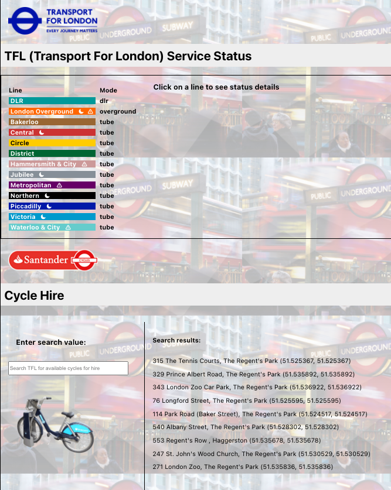
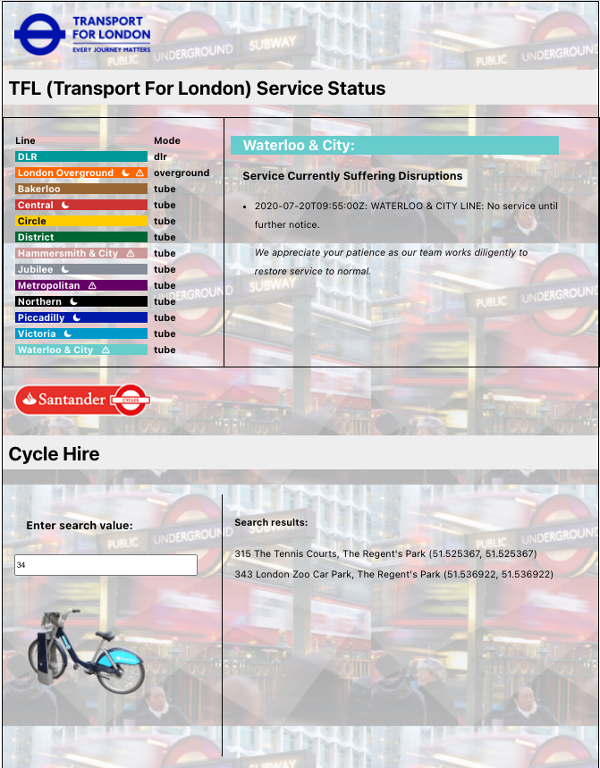
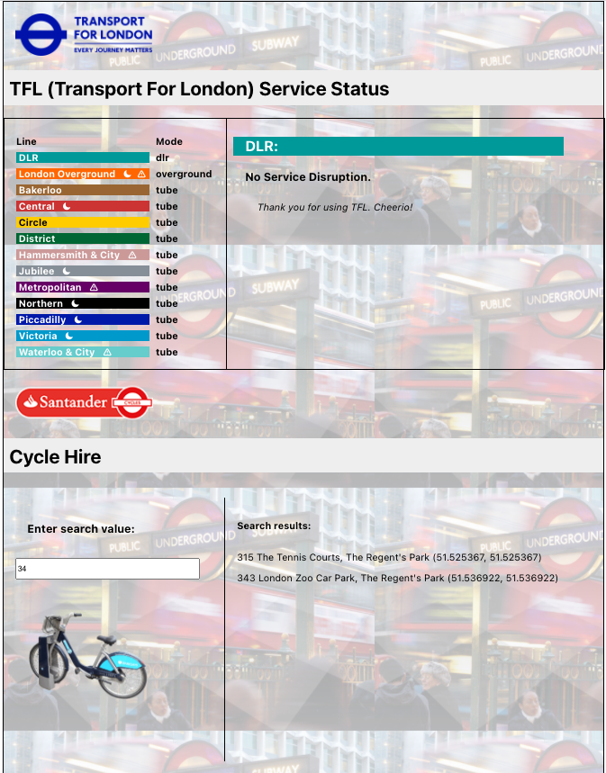

# TFL LITE
**by Karen Liu**

*This React app pulls data from the official TFL API and displays a menu of available lines. Users can view current status information and service interruptions and search for available cycles for hire in the London area. TFL LITE uses ES6 and Typescript (though App.js is regular JS). It also treats the user to a whimsical picture of Boris Johnson riding a bicycle on the loading screen because... Boris Johnson. The colors used for the line Names are the official hex colors used by TFL.*

## Dependencies and Tech:
`React-Table (version 7.6.3)`

`React-table Types (version 7.0.29)`

*I chose React-table because it's a highly-customizable table library with a lot of users. The documentation is weak; however, for this exercise, I didn't need a lot of table features, so I felt safe using it. That was until I discovered that the typescript types defined in react-table are not compatible with the way react-table is used. I worked around it by using "any" as the type for the columns and data. However, I would normally try to stick to the proposed types when using TypeScript.*

`Axios` 

*I chose Axios because of my familiarity with it and it is a clean and robust way of getting data.*

`Hooks`

*Hooks introduce fun, powerful tools that make it easier to do certain things like using state, eliminating the need for multiple lifecycle methods.*

`Typescript`

*Typescript ensures that the correct types are used and can also make the component page easier to read*

 

## What I would add to TFL LITE:

1. More unit tests

    *I would write tests to: ensure the search bar returns the correct results based on the user input, check that the line status information matches the data, that the name of the line matches the content shown, and that clicking the line name populates the content box.*

2. Add Redux
    
    *The app is small and simple as is; however, if the app were needed to be scaled; if more components were added and more API data were called, Redux would reduce complexity by allowing props to be easily accessed, rather than threading through multiple parent components.*

3. Improving DRY-ness of code; Preventing possible performance issues
    
    *As mentioned above, there could be more done to ensure the code is DRY enough to accommodate more components and dependencies being added. For example, the content box could be refactored in order to be re-used by different pages if pages were to be added to the app. The API calls could be organized into a separate page. If the cycle hire API returned hundreds or even thousands of results, it could clog performance with the way it is currently written because all of the data is being pulled in in App.js.*

4. Further separate components to accommodate scaling
    
    *Currently, the cycle hire content box and line disruptions content box are separate (even the the guidelines may have implied using just one box) because I thought about how the user might interact with the search feature. The user might want to see both boxes simultaneously while making a decision on whether to use the subway or hire a bicycle. Overriding the information about service disruptions with the cycle hire search results may result in a frustrating experience. Other parts of the code could also be further separated so that adding future components would not result in repeating of similar functions in multiple files. I did try to export functions for use in other files, such as the getDynamicCSS function in contentBox.tsx.*

 
 
 
 

## To start this app from the command line:

### `npm start`

Runs the app in the development mode.\
Open [http://localhost:3000](http://localhost:3000) to view it in the browser.

The page will reload if you make edits.\
You will also see any lint errors in the console.

### `npm test`

Launches the test runner in the interactive watch mode.\
See the section about [running tests](https://facebook.github.io/create-react-app/docs/running-tests) for more information.

### `npm run build`

Builds the app for production to the `build` folder.\
It correctly bundles React in production mode and optimizes the build for the best performance.

The build is minified and the filenames include the hashes.\
Your app is ready to be deployed!

See the section about [deployment](https://facebook.github.io/create-react-app/docs/deployment) for more information.

 

##Screenshots

